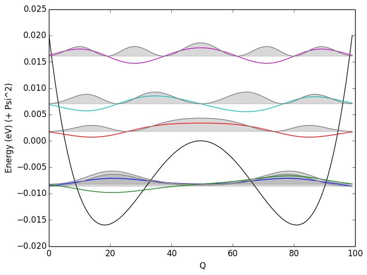

# Julia-SoftModeTISH-DeformationPotential

These are codes which solve the Schrodinger equation by discretisation to a grid. It is intended to be used on a 1D potential energy surface resulting from a mode-following of a 'soft' phonon mode in a crystal system. The resulting probability density function (from Bose-Einstein occupation of the solution eigenvalues) is then convolved with a band-gap deformation potential, to provide a measure of the electron-phonon coupling for this soft mode.

I apologise that everything is a bit messy! The codes were developed alongside my physical understanding, originally in some Jupyter notebooks, and then into a rather specific file with MAPI-coefficients hard coded. At some point I hope to revisit this and extend the generality. 

See this blog post for an informal discussion of the theory:
http://jarvist.github.io/post/2016-07-13-Electron-Phonon-Coupling-with-Soft-Modes/

And this paper for an application of the method to everyone's favourite Perovskite.
https://arxiv.org/abs/1609.00825

